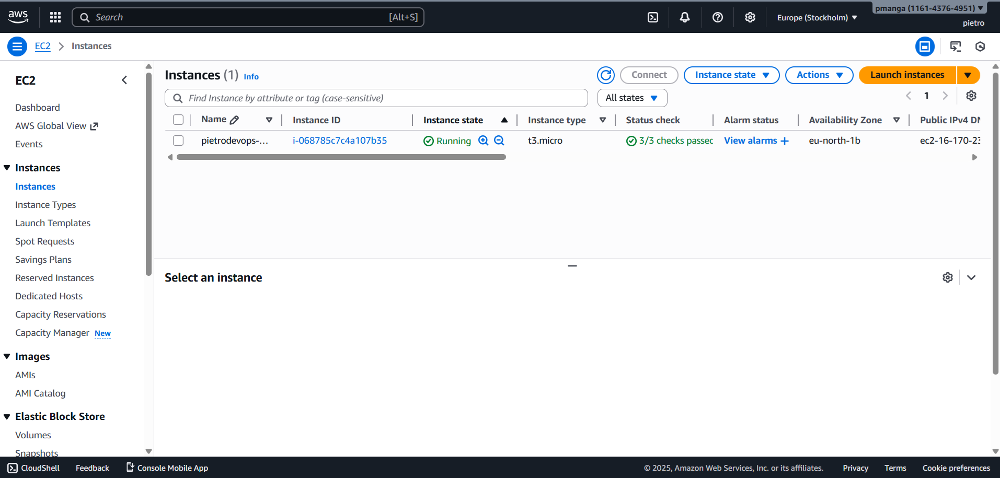
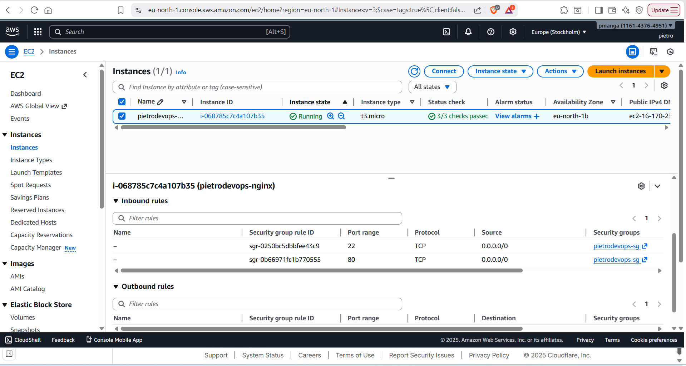
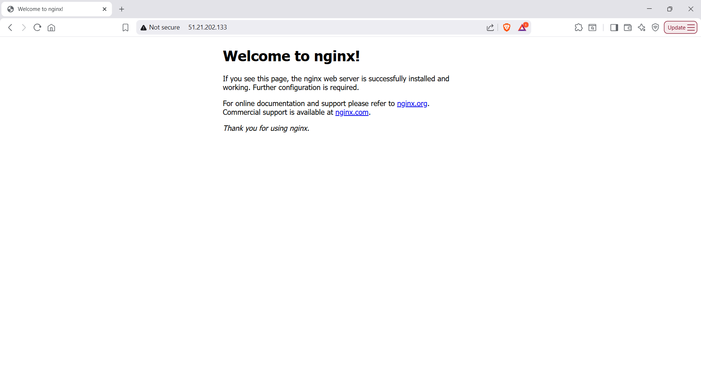
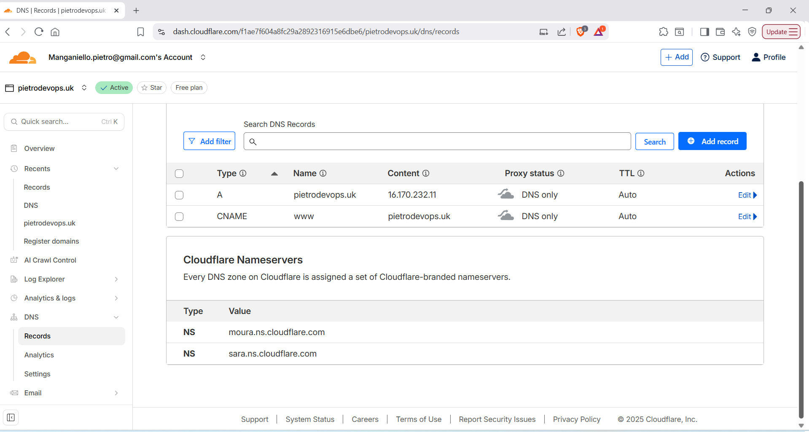

# Networking Fundamentals Project — Domain + EC2 + DNS

## Overview

This project demonstrates a complete end-to-end networking setup using real cloud infrastructure. The objective was to take a freshly purchased domain, deploy a Linux server on AWS, configure a web server, and route live internet traffic to it using proper DNS and networking principles.

This project brings together core concepts such as IP addressing, routing, firewalls, DNS resolution, ports, and cloud security groups.

The final result is a live website served from my own EC2 instance and accessed through my personal domain.

All supporting screenshots are available in the /screenshots folder.

**Live Website:**  
http://pietrodevops.uk  

**Direct EC2 Access:**  
http://51.21.202.133  

**Note:**  
The EC2 instance is currently **stopped** to avoid unnecessary cloud costs.  
The links above were live and fully functional during project validation and are included here to demonstrate the completed end-to-end setup.

---

## Architecture

User Browser  
↓  
DNS Resolution (Cloudflare)  
↓  
Public IPv4 Address (AWS EC2)  
↓  
AWS Security Group (Port 80 Allowed)  
↓  
NGINX Web Server (Amazon Linux 2023)

---

## Tools and Technologies Used

- AWS EC2  
- Amazon Linux 2023  
- NGINX  
- Cloudflare DNS  
- SSH  
- Git and GitHub  
- Linux CLI  

---

## What Was Built

- A public EC2 instance was launched using Amazon Linux  
- NGINX was installed and configured as the web server  
- A personal domain was purchased and connected to the EC2 instance using a DNS A record  
- Traffic from the internet now routes correctly to the cloud server and serves a live webpage  

---

## Key Networking Concepts Applied

- IPv4 addressing  
- DNS resolution and A records  
- Routing and public internet access  
- Firewall rules via AWS security groups  
- TCP Port 80 for HTTP traffic  
- SSH access on Port 22  
- Web server hosting with NGINX  

---

## Proof of Work

The following screenshots demonstrate:

- EC2 instance running
  

- Security group rules allowing SSH and HTTP

- NGINX running via public IP

- Domain successfully loading NGINX homepage

- Cloudflare DNS A record configuration

---

## Key Learnings

- How real network traffic moves across the internet  
- How DNS translates domain names into IP addresses  
- How firewall rules control access at the network level  
- How cloud servers expose services securely  
- How web servers handle HTTP requests  
- How public and private IP addressing works in practice  

---

## Status

- Project completed successfully  
- EC2 instance currently stopped to prevent unnecessary billing  
- DNS configuration preserved for future reactivation  

---

## Next Steps

- Add HTTPS via SSL  
- Automate EC2 provisioning using Terraform  
- Extend project into a full cloud infrastructure lab  

